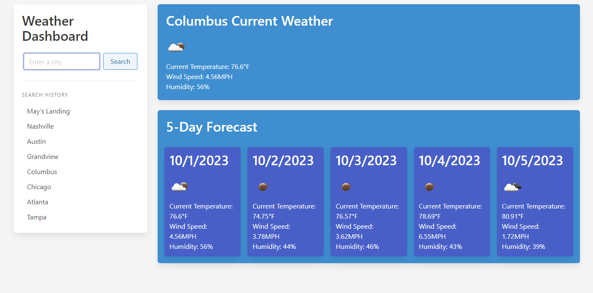

# Weather Dashboard (Module-06-Challenge)

This repository contains the HTML and JavaScript for a simple weather dashboard app.

## Table of Contents

- [Introduction](#introduction)
- [Instructions](#instructions)
- [Usage](#usage)
- [Credits](#credits)
- [License](#license)

## Introduction

The HTML and JavaScript code in this repository is an app for a simple weather dashboard that allows you to find the weather for most cities.

## Instructions

Enter any city name into the search bar, and the website will update with the current weather, and a 5-day forecast! Your search history will also be saved.

## Usage

See commented lines in the HTML and CSS files to see how the app works. Website is hosted [here.](https://nephh.github.io/weather-dashboard)

### Website Screenshot

## Credits

N/A

## License

Please refer to the license in the repo
